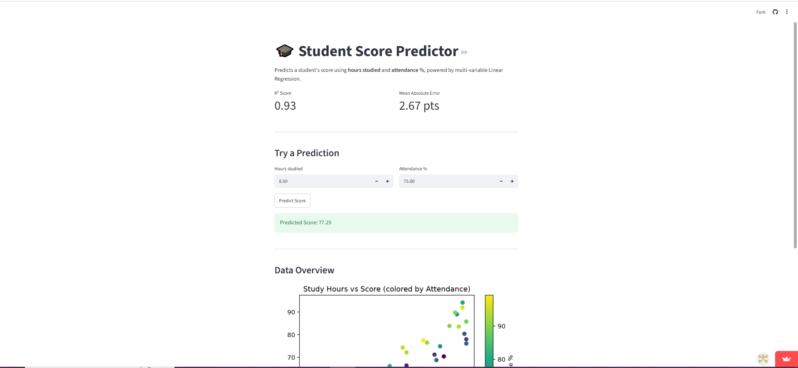

[](https://ethin69-student-score-predictor.streamlit.app/)
# 🎓 Student Score Predictor

A Machine Learning web app that predicts a student's exam score based on **hours studied** and **attendance percentage**, using multi-variable Linear Regression.

## 🌐 Live App

👉 https://ethin69-student-score-predictor.streamlit.app/

## 📊 Features

- Predicts scores from two inputs: study hours + attendance %
- Model performance shown live (R² score & Mean Absolute Error)
- Interactive Streamlit interface with real-time prediction
- Data visualization colored by attendance to show feature relationships
- Synthetic dataset generated with realistic noise (not just a straight-line fit)

## 🛠 Tech Stack

- Python
- Streamlit
- Pandas / NumPy
- Scikit-learn
- Matplotlib

## 🧠 Model Details

- **Algorithm:** Multi-variable Linear Regression
- **Features:** Hours Studied, Attendance %
- **Evaluation:** Train/test split (80/20), scored with R² and MAE
- **Why synthetic data with noise?** Real student performance isn't a perfectly straight line — the dataset includes randomized noise to simulate real-world variance, making the model evaluation meaningful rather than trivial.

## ▶️ Run Locally

```bash
pip install -r requirements.txt
streamlit run app.py
```

To retrain the model and regenerate plots/dataset:

```bash
python main.py
```

## 📁 Project Structure

student-score-predictor/
│
├── app.py # Streamlit web app
├── main.py # Training script + evaluation + plots
├── requirements.txt
├── README.md
├── student_data.csv # Generated dataset
├── graph.png # Hours vs Score visualization
└── regression_line.png # Actual vs Predicted performance plot

## 📈 Sample Results

| Metric | Value |
|---|---|
| R² Score | ~0.9x |
| MAE | ~X.X points |

*(Run `main.py` and paste your actual printed values here before pushing.)*
